# Order Delivery Flow

This document describes the intended order lifecycle between the customer app, admin panel, and rider app.

## Mermaid Diagram

```mermaid
flowchart LR
    A["Customer places order"] --> B["Order status: PLACED"]

    B --> C["Admin reviews order"]
    C --> D["Admin clicks CONFIRM"]
    D --> E["Order status: CONFIRMED"]

    E --> F["Backend sends rider assignment request"]
    F --> G["Rider app gets notification: New order available"]
    G --> H{"Rider accepts?"}

    H -->|No| I["Offer to another rider / keep pending assignment"]
    H -->|Yes| J["Order status: RIDER_ACCEPTED"]
    J --> K["WebSocket updates customer app"]
    J --> L["WebSocket updates rider app"]
    J --> M["Rider travels to shop"]

    M --> N["Admin clicks PACKED"]
    N --> O["Order status: PACKED"]
    O --> P["Rider app gets notification: Order packed"]
    P --> Q["Rider reaches shop and collects order"]

    Q --> R["Rider clicks PICKED_UP"]
    R --> S["Order status: PICKED_UP"]
    S --> T["WebSocket updates customer app: Picked up"]
    S --> U["WebSocket updates rider app"]

    U --> V["Rider starts delivery trip"]
    V --> W["Rider clicks OUT_FOR_DELIVERY"]
    W --> X["Order status: OUT_FOR_DELIVERY"]
    X --> Y["WebSocket updates customer app: Out for delivery"]
    X --> Z["Live rider location + ETA updates via WebSocket"]

    Z --> AA["Rider reaches customer"]
    AA --> AB["Rider clicks DELIVERED"]
    AB --> AC["Order status: DELIVERED"]
    AC --> AD["WebSocket updates customer app: Delivered"]
    AC --> AE["WebSocket updates rider app"]
    AC --> AF["Order completed"]

    E --> C1{"Customer cancels?"}
    J --> C1
    O --> C1
    S --> C1
    X --> C1

    C1 -->|Before rider pickup| C2["Order status: CANCELLED"]
    C2 --> C3["WebSocket updates customer app: Cancelled"]
    C2 --> C4["WebSocket updates admin panel"]
    C2 --> C5["Rider gets notification: Order cancelled, wait for next assignment"]
    C2 --> C6["Rider is released for new assignment"]

    C1 -->|After pickup / while outbound| C7["Order status: CANCELLED_IN_TRANSIT or CANCELLED"]
    C7 --> C8["WebSocket updates customer app: Cancelled"]
    C7 --> C9["WebSocket updates admin panel"]
    C7 --> C10["Rider gets urgent notification: Order cancelled, return to store"]
    C7 --> C11["Rider navigates back to store with package"]
    C11 --> C12["Admin/store handles return confirmation"]
```

## Suggested Status Flow

- `PLACED`
- `CONFIRMED`
- `RIDER_ACCEPTED`
- `PACKED`
- `PICKED_UP`
- `OUT_FOR_DELIVERY`
- `DELIVERED`

## Ownership

- Admin controls: `CONFIRMED`, `PACKED`
- Rider controls: `RIDER_ACCEPTED`, `PICKED_UP`, `OUT_FOR_DELIVERY`, `DELIVERED`
- Customer sees all updates through WebSocket

## Cancellation Flow

- Customer can cancel while the order is still active
- If cancellation happens before pickup:
  - order becomes `CANCELLED`
  - rider gets a normal cancellation notification
  - rider is immediately available for a new order
- If cancellation happens after pickup or while outbound:
  - order becomes `CANCELLED` or a dedicated `CANCELLED_IN_TRANSIT`
  - rider gets a high-priority notification to return to store
  - admin/store must handle reverse logistics or return confirmation
- Customer, admin, and rider apps should all receive the cancellation event through WebSocket
