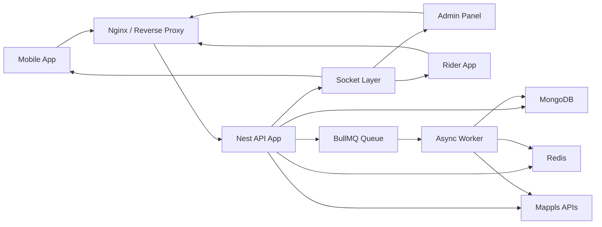
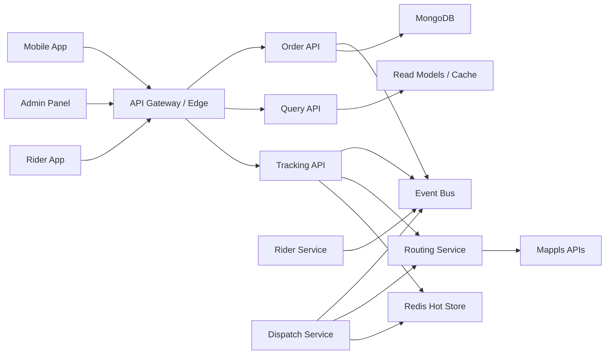
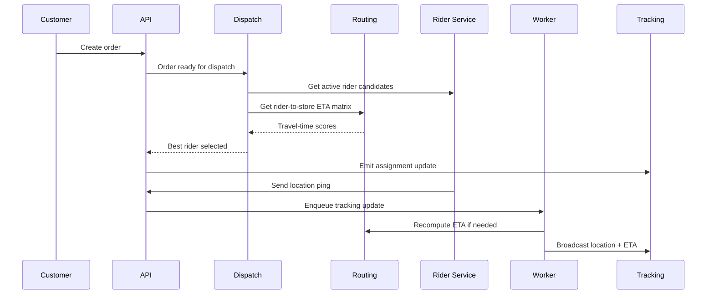

# Project Audit, Cost-Constrained Architecture, and Migration Plan

## Scope

This audit is based on:

- the current repository structure and code paths
- your updated constraints:
  - use MapmyIndia / Mappls instead of Google Maps
  - prefer AWS Free Tier or near-free usage for the initial phase
  - keep monthly infrastructure spend around INR 2,000
  - improve routing, tracking, rider dispatch, and backend architecture

This document answers four questions:

1. What are the current flaws in the project?
2. What should be kept?
3. What should change now?
4. What target architecture best fits your budget and growth stage?

## Executive Summary

The project has a solid MVP base, but it is not yet ready for efficient scale.

What is good:

- the app already has clear product layers: mobile app, admin app, backend
- Redis is already present
- rider geo-location exists
- websocket tracking exists
- the backend already has modules, DTOs, guards, and tests in important areas

What is weak:

- routing is tightly coupled to Google APIs
- important APIs mix command and query responsibilities
- order, ETA, rider tracking, and dispatch responsibilities are coupled together
- the backend is technically modular, but still operationally monolithic
- live tracking work is being done too close to the request path
- environment/security practices are not production-safe yet
- the current codebase is not optimized for a strict low-cost infrastructure target

Most important recommendation:

Do not jump directly to full microservices right now.

Under an INR 2,000/month cap, the best architecture is:

- modular monolith for core business APIs
- one async worker process for jobs, ETA, and notifications
- one dedicated real-time tracking/routing worker only when needed
- provider abstraction for MapmyIndia
- event-driven internal boundaries so services can be extracted later

This gives you:

- lower AWS cost
- lower operational complexity
- cleaner code boundaries
- a much safer path to future microservices

## Current Architecture Snapshot

### Repo shape

- Mobile app: React Native / Expo
- Admin app: Astro + React
- Backend: NestJS + MongoDB + Redis + BullMQ + Socket.IO

### Current backend style

The backend uses Nest modules, but it still behaves like a single deployable monolith:

- one Nest app in `backend/src/app.module.ts`
- one process for API + sockets + business logic
- feature modules depend on each other directly
- shared Redis and Mongo dependencies are used from the same process

This is a modular monolith, not a microservice architecture.

That is not automatically bad.

For your budget, it is actually the right base to improve from.

## Audit Findings

## 1. Maps and routing flaws

### Problem: Google routing is hardcoded on the client

File:

- `src/services/directionsService.js`

Issues:

- Google Directions is called directly from the mobile client
- the API key pattern is exposed in app code
- route behavior is controlled by the client, not the backend
- route caching, fallback, and cost control are weak

Impact:

- provider migration to MapmyIndia becomes harder
- future abuse or quota blowups become more likely
- route consistency differs by app version

### Problem: ETA service is provider-specific

File:

- `backend/src/modules/orders/eta.service.ts`

Issues:

- ETA is tightly coupled to Google Distance Matrix
- no routing provider abstraction exists
- cache strategy is point-to-point only and too basic

Impact:

- replacing Google with MapmyIndia becomes invasive
- scaling or failover across providers becomes difficult

### Problem: nearest rider logic is geo-near, not travel-time-aware

File:

- `backend/src/modules/riders/riders.service.ts`

Issues:

- nearby rider search uses MongoDB geospatial `$near`
- no travel-time matrix scoring
- no dispatch scoring model

Impact:

- the "nearest" rider on the map may not be the fastest rider on roads
- pickup ETA and fulfillment quality will be inconsistent

## 2. Tracking and real-time flaws

### Problem: websocket flow and ETA recomputation are too coupled

Files:

- `backend/src/sockets/tracking.gateway.ts`
- `backend/src/modules/riders/riders.service.ts`

Issues:

- rider location updates trigger downstream work too close to the request path
- location update currently causes DB update, broadcast, and ETA recalculation logic in the same operational flow

Impact:

- under load, rider updates can become slower
- tracking latency and ETA latency interfere with each other
- a single hot rider or many active orders can degrade overall responsiveness

### Problem: no map matching or route progress model

Issues:

- raw GPS is used directly
- no matched road segment
- no route deviation logic
- no ETA confidence score

Impact:

- noisy rider pins
- route progress jitter
- less reliable ETA

## 3. Backend architecture flaws

### Problem: modular monolith boundaries are not clean enough

File examples:

- `backend/src/modules/orders/orders.service.ts`
- `backend/src/modules/riders/riders.service.ts`

Issues:

- `orders.service.ts` is 426 lines and owns too many concerns:
  - order creation
  - stock interaction
  - status transitions
  - rider assignment
  - cache invalidation
  - Redis pub/sub
  - socket broadcast
  - ETA trigger
- rider service also mixes:
  - rider location persistence
  - throttling
  - order lookup
  - socket fanout
  - ETA trigger

Impact:

- changes are risky
- testing becomes broader and more brittle
- future service extraction becomes harder

### Problem: command and query concerns are mixed

Example:

- `backend/src/modules/orders/orders.controller.ts`

Issues:

- same controller mixes create, read, status read, history read, status update, rider assignment, admin listing
- write flows and read flows are not clearly separated

Impact:

- hard to scale APIs independently
- harder to apply different caching, auth, or throttling policies
- read-heavy and write-heavy paths are coupled

This likely matches your concern that “single API calls are handling in and out both.”

The architectural fix is:

- separate command APIs from query APIs
- optionally separate tracking APIs from transactional order APIs

## 4. Security and operational flaws

### Problem: insecure defaults exist

Files:

- `backend/src/config/configuration.ts`
- `backend/src/main.ts`
- `backend/src/sockets/tracking.gateway.ts`

Issues:

- default JWT secrets exist in config
- CORS is effectively open in backend HTTP layer
- websocket CORS is `origin: '*'`
- API URLs are hardcoded to localhost in multiple frontend/admin places

Impact:

- unsafe for production
- environment drift between dev and prod
- avoidable attack surface

### Problem: direct operational settings are embedded in app logic

Examples:

- local URLs in frontend/admin
- provider-specific keys and endpoint assumptions
- no centralized config contract per environment

Impact:

- hard deployments
- fragile staging/production rollout

## 5. Cost and infrastructure flaws

### Problem: current design leans toward services that become expensive fast

Issues:

- Redis is assumed, but managed Redis on AWS is not friendly to your budget
- MongoDB + Redis + Nest + admin + mobile backend can exceed your budget if each is separately managed
- direct third-party route API usage can create unpredictable spend

Impact:

- hard to stay below INR 2,000 if not carefully contained

## What Should Be Kept

These are worth keeping and building on:

### 1. NestJS modular structure

Even though the backend is still monolithic, the module structure is a good base.

Keep:

- auth module
- orders module
- riders module
- products/cart/users/settings modules

### 2. Redis usage pattern

Redis is the right tool for:

- short-lived cache
- token/session lookup
- queue backing
- hot tracking snapshots

Keep Redis, but do not assume managed ElastiCache at this stage.

### 3. GeoJSON rider location storage

The `currentLocation` schema in user records is useful as a durable source of truth.

Keep it for persistence and fallback querying.

### 4. Existing websocket room model

The room-per-order tracking model is a workable first implementation.

Keep it, but simplify what runs inside the live update path.

### 5. Test coverage in critical tracking/order areas

There are already tests around:

- tracking gateway
- ETA service
- rider service
- order flows

That is a strong base for refactoring.

## What Should Change First

## Phase 0: immediate fixes

### 1. Introduce a routing provider abstraction

Create:

- `RoutingProvider` interface
- `MapplsRoutingProvider` implementation

Move all route/ETA provider calls behind backend services.

### 2. Remove client-side directions API usage

Replace:

- direct `fetch()` to Google Directions in the client

With:

- backend endpoint that returns route polyline, ETA, and metadata

### 3. Split hot-path concerns

Current location update path should become:

1. receive location update
2. validate and store latest location
3. enqueue async processing
4. return fast acknowledgment

Async worker should handle:

- ETA refresh
- route progress updates
- tracking fanout if needed

### 4. Clean config and secrets handling

Remove insecure defaults and move all environment-sensitive values to env config:

- JWT secrets
- API base URLs
- Mappls credentials
- Redis host
- Mongo URI

### 5. Separate command and query APIs

Recommended split:

- `/orders/commands/*`
- `/orders/query/*`
- `/tracking/*`
- `/dispatch/*`

You do not have to expose these exact URLs publicly yet.
But you should separate the internal application services this way.

## MapmyIndia / Mappls Recommendation

## Why MapmyIndia is a good fit for this product

Mappls is a strong fit because:

- India coverage is a priority for your use case
- it offers routing, matrix, search, geocoding, and tracking capabilities
- it is a better strategic provider match for an India-first grocery delivery product

From official Mappls docs and product pages:

- routing and traffic-aware directions are supported
- distance matrix APIs are available
- tracking products exist
- free trial availability is public

Important note:

I could not verify a simple, publicly listed universal pay-as-you-go pricing sheet for all Mappls API families.
Their official public pages emphasize:

- free trial availability
- project-based access
- custom plans for some tracking/mobility products

So exact recurring Mappls monthly cost should be treated as a sales-confirmed variable, not a guaranteed public list price.

That means the architecture should minimize provider call volume.

## Mappls usage recommendation for phase 1

Use Mappls for:

- geocoding and reverse geocoding
- route generation
- ETA and distance matrix

Do not use third-party navigation SDK features you do not need yet.

To control budget:

- cache route responses
- cache matrix results by area cell
- rate limit rider ETA recalculation
- do not recompute on every GPS ping

## AWS Recommendation Under INR 2,000/month

## Reality check

A full microservice stack with separate managed components is not realistic under this budget.

If you try:

- API service
- worker service
- Redis managed
- Mongo managed
- load balancer
- logs
- public networking

you will likely overshoot.

## Better low-cost AWS architecture

### Option A: best practical starting setup

Use one small EC2 instance to host:

- Nest API
- BullMQ worker
- Redis in Docker
- reverse proxy

Use MongoDB Atlas free/shared tier initially, or a tiny self-hosted Mongo if absolutely necessary.

Use S3 only for media assets if needed.

Use Cloudflare in front for DNS, TLS, and basic caching instead of paying for more AWS edge components early.

This is the best fit for your budget target.

### Option B: if you are a brand new AWS customer

AWS changed its Free Tier in July 2025.
New accounts now get up to USD 200 in credits and a 6-month free plan, according to AWS’s official announcements and billing docs.

That helps temporarily, but it is not the same as a permanent “free production stack.”

So design for post-credit survival, not just free-tier onboarding.

## Recommended monthly cost target

For a small launch setup, a realistic target is:

- one small EC2 instance
- optional small block storage
- Mongo free/shared or external low-cost DB
- S3 for assets only if required
- no managed Redis
- no ALB initially

This is one of the few ways to stay near your INR 2,000 target.

## Recommended Target Architecture

## Architecture principle

Build a modular monolith that is extraction-ready.

That means:

- one deployable API app now
- one worker process now
- optional separate tracking/routing worker later
- event contracts from day one

## Logical service boundaries

Even if deployed together initially, separate the code into these bounded contexts:

1. Identity Service
2. Catalog Service
3. Cart Service
4. Order Command Service
5. Order Query Service
6. Rider Service
7. Dispatch Service
8. Routing Service
9. Tracking Service
10. Notification Service

## Recommended deployment shape now

## Recommended deployment shape later

## Internal module split recommendation

### 1. Order Command

Responsibilities:

- create order
- update status
- assign rider
- cancel order

### 2. Order Query

Responsibilities:

- order list
- order detail
- status history
- tracking snapshot

### 3. Rider Core

Responsibilities:

- rider profile
- online/offline
- capacity/state
- duty status

### 4. Rider Location

Responsibilities:

- ingest GPS pings
- validate freshness
- normalize location updates
- write hot location state

### 5. Dispatch

Responsibilities:

- candidate rider retrieval
- scoring
- assignment decision
- redispatch

### 6. Routing

Responsibilities:

- route API
- matrix API
- geocoding
- reverse geocoding
- provider-specific request mapping

### 7. Tracking

Responsibilities:

- order room membership
- push rider location snapshots
- push ETA updates
- push state changes

## Rider System Recommendation

I am interpreting your “writer set” request as a request for a proper rider setup / rider system.

That should include:

### Rider domain model

Add rider-specific fields:

- vehicle type
- max carrying capacity
- active order count
- preferred service zones
- verification status
- duty state
- battery/network quality if available later

### Rider state machine

Suggested rider states:

- `OFFLINE`
- `IDLE`
- `AVAILABLE`
- `ASSIGNED`
- `AT_STORE`
- `PICKED_UP`
- `DELIVERING`
- `PAUSED`

This is better than only using booleans like `isAvailable` and `isOnline`.

### Rider app responsibilities

- send GPS updates with configurable frequency
- acknowledge assignments
- navigate to store and customer
- send pickup/drop milestones
- recover from offline mode gracefully

### Rider assignment workflow

1. Order becomes dispatchable.
2. Dispatch service finds candidates.
3. Best rider receives assignment offer.
4. Timeout or reject triggers fallback candidate.
5. Accepted assignment updates rider state and order state.

## Command-Query Structure Recommendation

This directly addresses your concern about “single API calls handling in and out both.”

### Commands

These change state:

- place order
- assign rider
- accept order
- update status
- cancel order
- update rider availability

### Queries

These read state:

- get order list
- get order details
- get status history
- get tracking state
- get nearby riders for admin visibility

### Why this matters

- easier caching
- safer auth rules
- better monitoring
- easier extraction into separate services later

## Proposed Data Flow

## Concrete Refactor Plan For This Repo

## Step 1

Create new backend modules:

- `routing`
- `dispatch`
- `tracking-application`
- `rider-location`
- `orders-query`
- `orders-command`

## Step 2

Move provider logic out of:

- `src/services/directionsService.js`
- `backend/src/modules/orders/eta.service.ts`

into:

- `backend/src/modules/routing`

## Step 3

Refactor `orders.service.ts` so it no longer directly owns:

- websocket broadcast
- ETA provider calls
- assignment scoring logic

## Step 4

Refactor rider location updates so the synchronous path does only:

- auth
- payload validation
- freshness check
- hot-location write
- enqueue job

## Step 5

Replace boolean rider availability with a proper rider state model.

## Step 6

Move hardcoded URLs and provider config into environment-driven config.

## Best Future-Proof Decisions

These are the best long-term decisions to make now:

### 1. Keep the code modular, but deploy cheaply

This is the highest-value compromise.

### 2. Build provider abstraction before deeper map features

If you do this first, Mappls migration will be much cleaner.

### 3. Separate hot path and slow path

Never make route recomputation block rider update acknowledgments.

### 4. Introduce event contracts early

Even if you use BullMQ and Redis first, model events cleanly now:

- `order.created`
- `order.ready_for_dispatch`
- `rider.location.updated`
- `rider.assigned`
- `eta.updated`

### 5. Delay full microservices until traffic justifies them

That is the correct technical and financial move here.

## Suggested AWS Build

## Stage 1

- 1 small EC2 instance
- Docker Compose
- Nginx
- Nest API
- BullMQ worker
- Redis container
- MongoDB Atlas free/shared or external low-cost option
- Cloudflare for DNS/TLS

## Stage 2

- split worker onto second small instance only if needed
- introduce managed logging or S3 archival
- add backup automation

## Stage 3

- extract tracking and dispatch into separate services when scale demands it

## Final Recommendation

The current project should not be rebuilt as “many microservices” right now.

The right move is:

- keep the current repo structure
- clean the service boundaries
- introduce routing and dispatch modules
- move to MapmyIndia through a provider abstraction
- separate command and query flows
- run a low-cost modular monolith + async worker architecture on AWS

That gives you:

- lower spend
- faster delivery
- cleaner code
- easier future extraction
- much better maps, rider, ETA, and route design

## Sources

- AWS Free Tier overview:
  - https://aws.amazon.com/free
- AWS Free Tier July 2025 update:
  - https://aws.amazon.com/about-aws/whats-new/2025/07/aws-free-tier-credits-month-free-plan
- AWS Billing docs for Free Tier:
  - https://docs.aws.amazon.com/awsaccountbilling/latest/aboutv2/free-tier.html
- AWS EC2 pricing:
  - https://aws.amazon.com/ec2/pricing/
- MapmyIndia / Mappls platform:
  - https://mapmyindia.com/
- MapmyIndia API landing page:
  - https://www.mapmyindia.com/api/landing-page/
- Mappls routing docs:
  - https://developer.mappls.com/documentation/sdk/rest-apis/mappls-routing-api/readme/
- Mappls directions docs:
  - https://developer.mappls.com/mapping/directions/
- Mappls mobility/tracking page:
  - https://www.mapmyindia.com/api/mobility-and-tracking/
